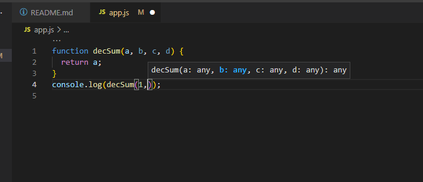
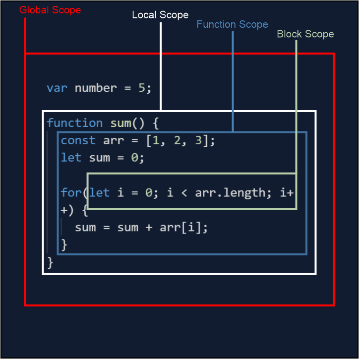
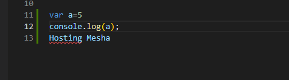
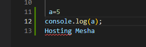
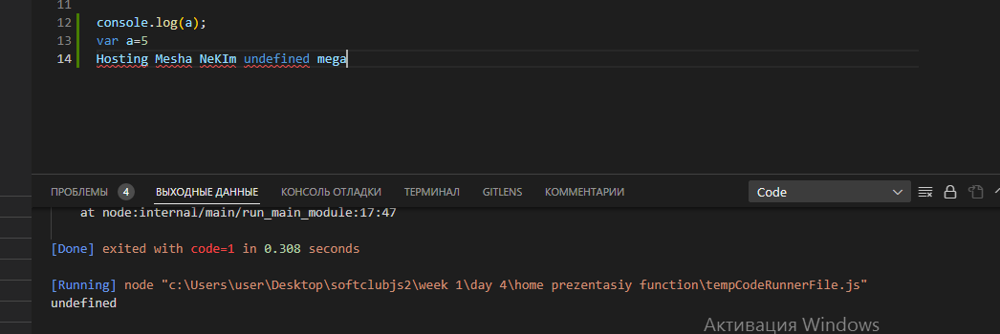

# function-new-Js

### Table Of Contents

#### 1 Function

#### 2 Scope

#### 3 Hosting

#### 4 Recursion and Closure

# Function

# Function Declaration

### Misol

# Function Expression

#### Misol Expression

# Scopie Oblast Vidimost JavaScript

### Scopie – Lexical Scope

#### Misol

# Function Recursive

# Function Closure

